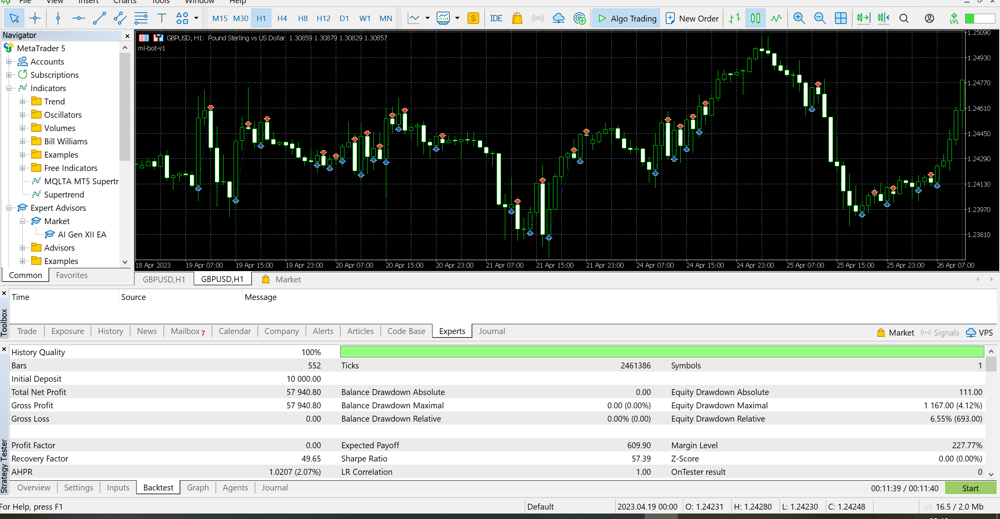
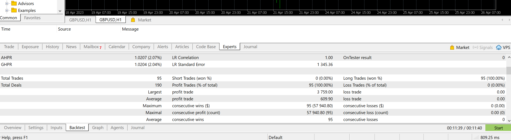

# ML-Based Trading System

## Overview

This project implements a machine learning-based trading strategy for the Forex market. The system consists of two main components:

1. **Python Server**: A server that processes requests, retrieves predictions from a CSV file, and communicates with the MQL5 bot.
2. **MQL5 Bot**: An Expert Advisor (EA) for MetaTrader 5 that reads predictions, interacts with the Python server, and executes trades based on the predictions.

## Strategy

The trading strategy leverages machine learning predictions to determine market trends. The system predicts whether the market will move up or down and places buy or sell orders accordingly. The lot size is dynamically adjusted based on the account balance to optimize risk management.

## System Design

- **Prediction Storage**: Predictions are stored in `predictions.csv` and converted to JSON for communication.
- **Python Server**: Listens on `localhost:8104` for requests from the MQL5 bot and responds with predictions.
- **MQL5 Bot**: Reads predictions from `predictions.txt` and sends requests to the Python server for real-time predictions.
- **Integration**: The Python server and MQL5 bot communicate via sockets, and predictions are shared through a common file.

## Testing

The system has been tested in a simulated trading environment. Below are some screenshots of the test results:




## Getting Started

1. Update `predictions.csv` with the latest predictions via the ml_dev_forex.ipynb.
2. Run the Python server:
   ```bash
   python ml-server.py
   ```
3. Deploy the MQL5 bot in MetaTrader 5 and attach it to a chart.

## File Structure

- `ml-server.py`: Python server script.
- `ml-bot-v1.mq5`: MQL5 bot script.
- `predictions.csv`: CSV file containing predictions.
- `predictions.txt`: JSON file for communication between the server and bot.

## Notes

- Ensure the Python server is running before deploying the MQL5 bot.
- Regularly update `predictions.csv` to maintain accurate predictions.

## License

This project is licensed under the MIT License.
